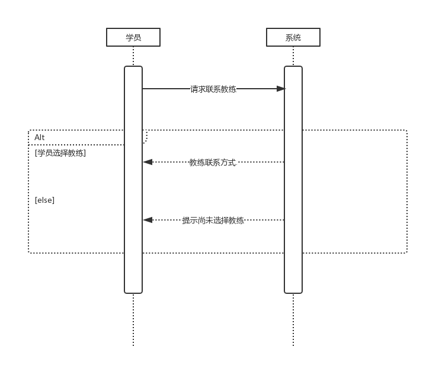
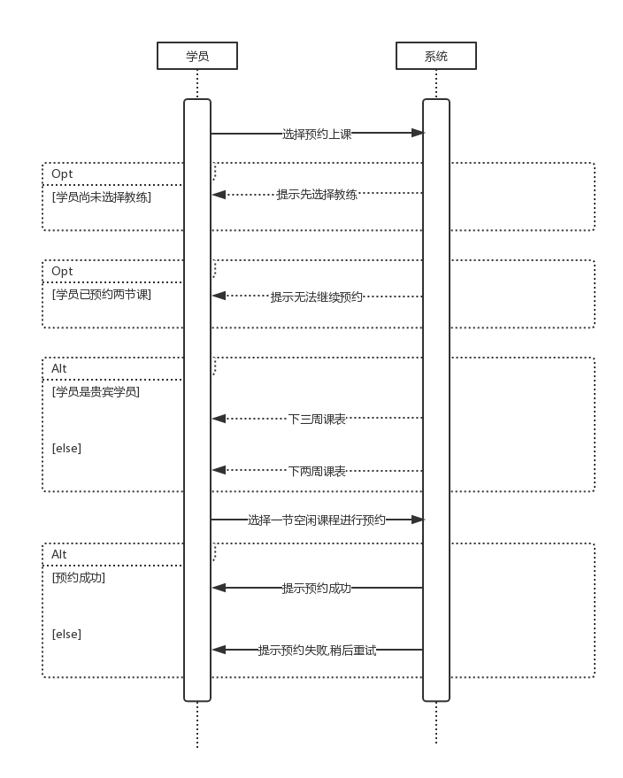
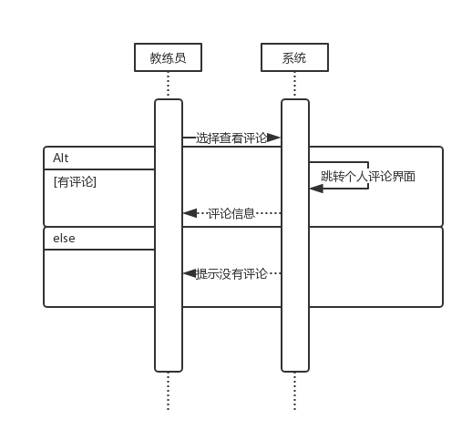

# 需求分析模型

## 更新历史

| 日期         | 作者   | 更新内容   |
| ---------- | ---- | ------ |
| 2016/11/26 | 万云天  | 建立文档架构 |

##索引
[TOC]

## 1 建立领域模型

### 1.1 发现对象和类

我们使用了概念类分类列表的方法，在需求信息中寻找相应类别的候选对象， 最后对候选对象进行确定和归纳，形成概念类。 

| 用例名称      | 用例描述                                     | 候选对象                                     | 概念类                  |
| --------- | ---------------------------------------- | ---------------------------------------- | -------------------- |
| 学员联系教练    | 1. 学员登录之后，选择联系教练，系统显示教练的公开信息，包括id和联系方式 2. 学员自行在系统外联系教练 | 学员, 教练, 教练公开信息, 教练id, 教练联系方式, 系统 | 学员, 教练, 教练公开信息 |
| 学员预约上课    | 1. 学员登陆之后选择预约上课，系统显示本周和下周的排课情况(贵宾学员延长至3周) 2. 学员根据自己情况和课表安排情况，选择一节空闲的课预约 3. 系统确认学生选课，提示选课成功并更改排课情况 |                                          |                      |
| 学员请假      | 1. 学员登录之后选择自己已经预约的课程并选择请假 2. 系统提示不可逆操作，收到确认之后确认学员请假，更新排课情况以供其他人选课 |                                          |                      |
| 学员接收通知    | 1. 系统发送推送给学员 2.学员收到消息                 |                                          |                      |
| 学员查看课程信息  | 1. 学员选择查看课程信息 2.系统显示这个学员的学习进度和课程预约情况  |                                          |                      |
| 学员评价教练    | 1. 学员选择对这轮课程教练的星级评价和文字评价 2. 系统保存评价    |                                          |                      |
| 学员选择教练    | 1. 学员选择选择教练 2. 系统返回所有学员数还未满的教练供其选择 3. 学员确定教练 4.系统保存信息 |                                          |                      |
| 教练员请假     | 1. 教练员提出请假要求，系统返回一段时间让其选择 2. 教练员选择一段时间(不超过3天)，填写请假缘由，并提交请假 3. 系统接收其请求，提交至管理员处等待审批 |                                          |                      |
| 教练员接收通知   | 1. 系统发送推送给教练员 2.教练员收到消息               |                                          |                      |
| 教练员查看课程信息 | 1. 教练员请求查看课程信息 2. 系统返回本周的课程情况，包括每天的课表，课表对应的学生姓名。 |                                          |                      |
| 教练员管理学员   | 1. 教练员请求管理学员，系统返回他现在所有学生的列表 2. 教练员选择某个学员，可以看到他的联系方式和学习进度，以及教练员之前做的笔记 3. 教练员选择对该学员的某一节课做笔记 4. 系统返回表单让教练员填写该学生的笔记 4. 教练员提交笔记，系统按照时间保存该笔记 |                                          |                      |
| 教练员修改个人信息 | 1.教练员请求修改个人信息请求 2. 系统返回表单 3. 教练员填写表单并提交 4. 系统保存信息 |                                          |                      |
| 教练员查看个人评价 | 1. 教练员请求查看自己的评价 2.系统显示自己的评分和各个学院对自己的评价 |                                          |                      |
| 管理员管理学员   | **增**:管理员在有新学员时，需要在系统中给其分配账号 **删:**有学员学业完成时，管理员需要删除该学员相关信息 **改:**有学员提出修改自己信息(不在系统内)时，管理员需要修改信息 |                                          |                      |
| 管理员管理教练员  | **增**:管理员在有新教练时，需要在系统中给其分配账号 **删:**有教练离职时，管理员需要删除该学员相关信息 **改:**有教练提出修改自己信息(不在系统内)时，管理员需要修改信息 |                                          |                      |
| 管理员审批请假   | 1. 管理员要求查看未审批的请假需求，系统按照时间赶回未审核假条 2. 管理员同意或者驳回某假条 3. 系统发送通知给教练告知情况。如果请假成功的话，还需要发送通知给有关学生告知教练请假，并更新选课情况 |                                          |                      |
| 管理员管理课程   | 1.管理员选择某一天某一节课 2. 系统显示这节课驾校所有课程 3. 管理员可以选定一个教练和学员，在这个时间段添加一节课或者对现有的课程进行删除 |                                          |                      |
| 管理员设置常量   | 可以更改的常量包括但不限于: 1. 法定节假日(不能选课的日子)  2. 普通学员，贵宾学员可以提前预约的天数 3. 每个教练同时教的学生数 4. 学员可以同时选择的课时数 5. 预约表刷新的时间 6. 学区 7. 学员，教练请假提前的天数 |                                          |                      |

### 1.2 建立类之间的关联

### 1.3 添加类的重要属性

## 2 建立行为模型

### 2.1 建立交互图（系统顺序图）

#### 2.1.1 学员联系教练

#### 2.1.2 学员预约上课

#### 2.1.3 学员请假

#### 2.1.4 学员接收通知

#### 2.1.5 学员查看课程信息

#### 2.1.6 学员评价教练

#### 2.1.7 学员选择教练

#### 2.1.8 教练员请假

#### 2.1.9 教练员接收通知

#### 2.1.10 教练员查看课程信息

#### 2.1.11 教练员管理学员

#### 2.1.12 教练员修改个人信息

#### 2.1.13 教练员查看个人评价

#### 2.1.14 管理员管理学员

#### 2.1.15 管理员管理教练员

#### 2.1.16 管理员审批请假

#### 2.1.17 管理员管理课程

#### 2.1.18 管理员设置常量

### 2.2 建立状态图

#### 2.2.1 学员状态图

#### 2.2.2 教练员状态图

#### 2.2.3 管理员状态图

### 2.3 建立活动图

## 3 契约说明

