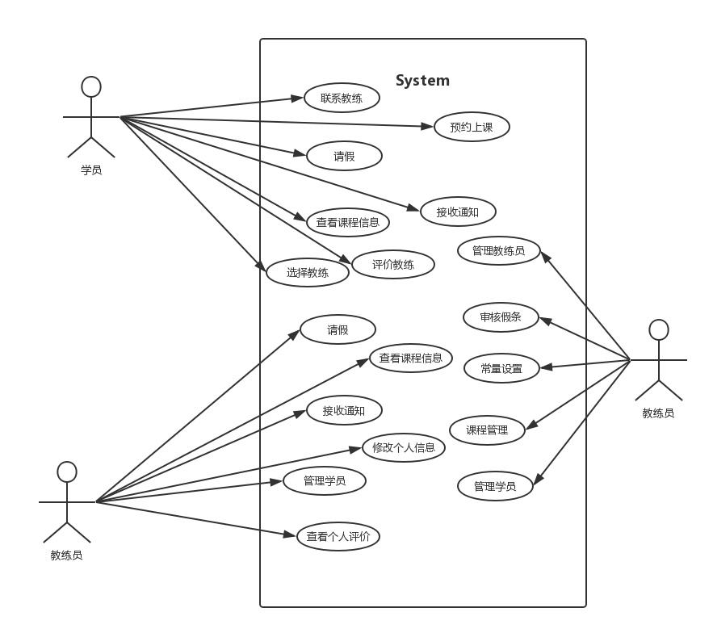

# 用例文档

## 更新历史

| 日期         | 作者   | 更新信息       |
| ---------- | ---- | ---------- |
| 2016/10/27 | 朱俊文  | 建立文档架构     |
| 2015/10/31 | 汤大业  | 编写学员部分用例   |
| 2015/11/05 | 汤大业  | 基本完成       |
| 2016/11/07 | 汤大业  | 根据会议内容修改部分 |
##索引
[TOC]

## 引言

​	该文档编写目的是将系统的所有用例文档化，用自然语言描述用户所有期望的操作，记录、交流领域信息和用户期望，传达有关问题域的必要信息以及涉众的需求，通过这些描述，尽可能将用户前景和需求从抽象中提取出来。

## 内容概述

​	本用例文档是根据前一阶段项目前景和范围的获取和分析，对解决方案的细化而得到的，传达了有关
问题域的必要信息以及涉众需求。本文档首先列出系统用例图，简要概述每个概要用例及其展开用例，之后详细定义了每个展开用例，包括ID、名称、创建者、最后一次更新者、创建日期、最后更新日期、参与者、描述、优先级、触发条件、前置条件、后置条件、正常流程、分支流程、异常流程、 相关用例、特殊需求和假设。

## 用例图

​	经过第一次面谈，对问题进行分析而得到的系统用例图

## 用例描述

### 1 学员

#### 1.1 联系教练

| Key  | Value                                    |
| ---- | ---------------------------------------- |
| ID   | UC1                                      |
| 名称   | 联系教练                                     |
| 优先级  | 中                                        |
| 触发条件 | 学员有事情需要联系教练                              |
| 前置条件 | 需要联系的教练信息对该学员公开                          |
| 后置条件 | 无                                        |
| 正常流程 | 1. 学员登录之后，选择联系教练，系统显示教练的联系方式(QQ，手机，微信号) 2. 学员自行在系统外联系教练 |
| 异常流程 | 1. 学员还没有选择教练或者教练离职 系统不公开任何信息          |
| 业务规则 | 无                                        |
| 特殊需求 | 无                                        |

#### 1.2 预约上课

| Key  | Value                                    |
| ---- | ---------------------------------------- |
| ID   | UC2                                      |
| 名称   | 预约上课                                     |
| 优先级  | 极高                                       |
| 触发条件 | 学员需要预约上课                                 |
| 前置条件 | 学员最多已经预约了一节课; 学员已经选择了教练; 学员课时允许;   |
| 后置条件 | 准确记录预约信息，成功预约一节课                         |
| 正常流程 | 1. 学员登陆之后选择预约上课，系统显示本周和下周的排课情况(贵宾学员延长至3周) 2. 学员根据自己情况和课表安排情况，选择一节空闲的课预约 3. 系统确认学生选课，提示选课成功并更改排课情况 |
| 异常流程 | 2. 系统显示的排课情况显示没有空闲课程或者均与学员自身情况不合 学员放弃选课，等待第二天更新排课表 3. 并发的学员选课 系统提示系统繁忙刷新后再试 |
| 业务规则 | 有两个正常的学员(两人一车)选择同一个上(下)午的课时，该上(下)午对任何学员显示不可选 有一个正常的学员(两人一车)选择一个上(下)午的课时，该上(下)午对正常学员显示可选，对贵宾学员(一人一车)显示不可选 有一个贵宾学员选择一个上(下)午的课时，该上(下)午对任何学员显示不可选 |
| 特殊需求 | 系统排课表将在每天早上8点刷新(也就是说早上8点将会可选下一周新的一天) 学生希望看到未来几天的天气情形 |

#### 1.3 请假

| Key  | Value                                    |
| ---- | ---------------------------------------- |
| ID   | UC3                                      |
| 名称   | 学生请假                                     |
| 优先级  | 中                                        |
| 触发条件 | 学员因为紧急情况需要取消自己预约的课程                      |
| 前置条件 | 学员至少有一节已经预约的课程 距离预约的课程超过2天            |
| 后置条件 | 准确记录取消预约信息，更新排课情况                        |
| 正常流程 | 1. 学员登录之后选择自己已经预约的课程并选择请假 2. 系统提示不可逆操作，收到确认之后确认学员请假，更新排课情况以供其他人选课 |
| 异常流程 | 2. 学员收到不可逆操作的警告之后放弃请假 系统不做任何处理，结束流程   |
| 业务规则 | 无                                        |
| 特殊需求 | 无                                        |

#### 1.4 接收通知

| Key  | Value                                    |
| ---- | ---------------------------------------- |
| ID   | UC4                                      |
| 名称   | 学员接收通知                                   |
| 优先级  | 中                                        |
| 触发条件 | 系统有重要消息通知学员                              |
| 前置条件 | app获得推送权限                                |
| 后置条件 | 学员收到系统的推送                                |
| 正常流程 | 1. 系统发送推送给学员 2.学员收到消息                 |
| 异常流程 | 无                                        |
| 业务规则 | 无                                        |
| 特殊需求 | 某些通知(例如已经预约的某节课教练请假)可能伴随着排课信息的变化和学员学习情况的变化 |

#### 1.5 查看课程信息

| Key  | Value                                   |
| ---- | --------------------------------------- |
| ID   | UC5                                     |
| 名称   | 学员查看课程信息                                |
| 优先级  | 高                                       |
| 触发条件 | 学员想要查看自己的学习情况和预约课程信息                    |
| 前置条件 | 无                                       |
| 后置条件 | 学员获悉学习情况和课程信息                           |
| 正常流程 | 1. 学员选择查看课程信息 2.系统显示这个学员的学习进度和课程预约情况 |
| 异常流程 | 无                                       |
| 业务规则 | 无                                       |
| 特殊需求 | 无                                       |

#### 1.6 评价教练

| Key  | Value                                 |
| ---- | ------------------------------------- |
| ID   | UC6                                   |
| 名称   | 学员评价教练                                |
| 优先级  | 中                                     |
| 触发条件 | 学员在某轮课程(科目二，科目三)上完之后                  |
| 前置条件 | 无                                     |
| 后置条件 | 学员对教练做出评价                             |
| 正常流程 | 1. 学员选择对这轮课程教练的星级评价和文字评价 2. 系统保存评价 |
| 异常流程 | 1.a 文字评价中有敏感词汇 系统不保存该文字评价，也不作出提示   |
| 业务规则 | 无                                     |
| 特殊需求 | 需要实名制                                 |

#### 1.7 选择教练

| Key  | Value                                    |
| ---- | ---------------------------------------- |
| ID   | UC7                                      |
| 名称   | 学员选择教练                                   |
| 优先级  | 高                                        |
| 触发条件 | 学员开始一轮新的课程或者原先就教练不再教授时                   |
| 前置条件 | 无                                        |
| 后置条件 | 学员获得了一个新的教练                              |
| 正常流程 | 1. 学员选择选择教练 2. 系统返回所有学员数还未满的教练供其选择 3. 学员确定教练 4.系统保存信息 |
| 异常流程 | 无                                        |
| 业务规则 | 无                                        |
| 特殊需求 | 1.提供搜索功能可以按照姓名搜索 2. 提供按照评分排序的功能，可以很清楚的看到评价 |

### 2 教练员

#### 2.1 请假

| Key  | Value                                    |
| ---- | ---------------------------------------- |
| ID   | UC8                                      |
| 名称   | 教练员请假                                    |
| 优先级  | 中                                        |
| 触发条件 | 教练因为紧急情况需要请假一段时间;请假开始的时间距离今天超过2天         |
| 前置条件 | 无                                        |
| 后置条件 | 系统提交申请至管理员处                              |
| 正常流程 | 1. 教练员提出请假要求，系统返回一段时间让其选择 2. 教练员选择一段时间(不超过3天)，填写请假缘由，并提交请假 3. 系统接收其请求，提交至管理员处等待审批 |
| 异常流程 | 1~2.a 教练员取消请假要求 系统返回不做任何处理            |
| 业务规则 | 无                                        |
| 特殊需求 | 请假成功之后，需要发送通知给这段时间内有该教练课程的学员             |

#### 2.2 接收通知

| Key  | Value                    |
| ---- | ------------------------ |
| ID   | UC9                      |
| 名称   | 教练接收通知                   |
| 优先级  | 中                        |
| 触发条件 | 系统有重要消息通知学员              |
| 前置条件 | app获得推送权限                |
| 后置条件 | 教练员收到系统的推送               |
| 正常流程 | 1. 系统发送推送给学员 2.学员收到消息 |
| 异常流程 | 无                        |
| 业务规则 | 无                        |
| 特殊需求 | 教练员需要在每晚10点左右接收到第二天课程的通知 |

#### 2.3 查看课程信息

| Key  | Value                                    |
| ---- | ---------------------------------------- |
| ID   | UC10                                     |
| 名称   | 教练员查看课程信息                                |
| 优先级  | 高                                        |
| 触发条件 | 教练员需要查看课程信息                              |
| 前置条件 | 无                                        |
| 后置条件 | 教练员获悉未来一周的课程信息                           |
| 正常流程 | 1. 教练员请求查看课程信息 2. 系统返回本周的课程情况，包括每天的课表，课表对应的学生姓名。 |
| 异常流程 | 无                                        |
| 业务规则 | 无                                        |
| 特殊需求 | 希望可以看见每天的天气情况，或者至少是后面几天的天气情况             |

#### 2.4 管理学员

| Key  | Value                                    |
| ---- | ---------------------------------------- |
| ID   | UC11                                     |
| 名称   | 教练员管理学员                                  |
| 优先级  | 高                                        |
| 触发条件 | 教练员需要联系某个学员或者需要对某个学员做一些笔记以记忆该学员的学习情况     |
| 前置条件 | 无                                        |
| 后置条件 | 无                                        |
| 正常流程 | 1. 教练员请求管理学员，系统返回他现在所有学生的列表 2. 教练员选择某个学员，可以看到他的联系方式和学习进度，以及教练员之前做的笔记 3. 教练员选择对该学员的某一节课做笔记 4. 系统返回表单让教练员填写该学生的笔记 4. 教练员提交笔记，系统按照时间保存该笔记 |
| 异常流程 | 2.a 教练员还没有对该学员做出笔记 系统提示教练员还没有笔记 3~4.a 教练员放弃编辑笔记  系统不做保存，放弃正在编辑的笔记 |
| 业务规则 | 无                                        |
| 特殊需求 | 无                                        |

#### 2.5 修改个人信息

| Key  | Value                                    |
| ---- | ---------------------------------------- |
| ID   | UC12                                     |
| 名称   | 教练员修改个人信息                                |
| 优先级  | 中                                        |
| 触发条件 | 教练员需要修改(非重要的)个人信息                        |
| 前置条件 | 无                                        |
| 后置条件 | 教练员个人信息得到修改                              |
| 正常流程 | 1.教练员请求修改个人信息请求 2. 系统返回表单 3. 教练员填写表单并提交 4. 系统保存信息 |
| 异常流程 | 无                                        |
| 业务规则 | 无                                        |
| 特殊需求 | 可以修改的信息包括:QQ号，车牌号等                       |

#### 2.6 查看个人评价	

| Key  | Value                                    |
| ---- | ---------------------------------------- |
| ID   | UC13                                     |
| 名称   | 教练员查看自己的评价                               |
| 优先级  | 高                                        |
| 触发条件 | 无                                        |
| 前置条件 | 无                                        |
| 后置条件 | 教练员获悉自己的评价情况                             |
| 正常流程 | 1. 教练员请求查看自己的评价 2.系统显示自己的评分和各个学院对自己的评价 |
| 异常流程 | 无                                        |
| 业务规则 | 无                                        |
| 特殊需求 | 无                                        |

### 3 管理人员

#### 3.1 管理学员

| Key  | Value                                    |
| ---- | ---------------------------------------- |
| ID   | UC14                                     |
| 名称   | 管理学员                                     |
| 优先级  | 高                                        |
| 触发条件 | 管理员需要管理学员                                |
| 前置条件 | 无                                        |
| 后置条件 | 无                                        |
| 正常流程 | **增**:管理员在有新学员时，需要在系统中给其分配账号 **删:**有学员学业完成时，管理员需要删除该学员相关信息 **改:**有学员提出修改自己信息(不在系统内)时，管理员需要修改信息 |
| 异常流程 | 无                                        |
| 业务规则 | 无                                        |
| 特殊需求 | 可以修改的信息包括：学区，是否是贵宾，手机号，剩余课时数等            |

#### 3.2 管理教练员

| Key  | Value                                    |
| ---- | ---------------------------------------- |
| ID   | UC15                                     |
| 名称   | 管理教练                                     |
| 优先级  | 高                                        |
| 触发条件 | 管理员需要管理教练                                |
| 前置条件 | 无                                        |
| 后置条件 | **增**:管理员在有新教练时，需要在系统中给其分配账号 **删:**有教练离职时，管理员需要删除该学员相关信息 **改:**有教练提出修改自己信息(不在系统内)时，管理员需要修改信息 |
| 正常流程 | 无                                        |
| 异常流程 | 无                                        |
| 业务规则 | 无                                        |
| 特殊需求 | 可以修改的信息包括：学区，教授科目，手机号，车牌等                |

#### 3.3 审核请假

| Key  | Value                                    |
| ---- | ---------------------------------------- |
| ID   | UC16                                     |
| 名称   | 审核教练员请假                                  |
| 优先级  | 中                                        |
| 触发条件 | 无                                        |
| 前置条件 | 有未审批的请假要求                                |
| 后置条件 | 管理员同意请假或者不同意请假                           |
| 正常流程 | 1. 管理员要求查看未审批的请假需求，系统按照时间赶回未审核假条 2. 管理员同意或者驳回某假条 3. 系统发送通知给教练告知情况。如果请假成功的话，还需要发送通知给有关学生告知教练请假，并更新选课情况 |
| 异常流程 | 无                                        |
| 业务规则 | 无                                        |
| 特殊需求 | 无                                        |

#### 3.4 课程管理

| Key  | Value                                    |
| ---- | ---------------------------------------- |
| ID   | UC17                                     |
| 名称   | 管理员管理课程                                  |
| 优先级  | 中                                        |
| 触发条件 | 某些学员还是习惯电话联系约课或者作为过渡;出现特殊情况需要添加课程或者取消课程  |
| 前置条件 | 无                                        |
| 后置条件 | 无                                        |
| 正常流程 | 1.管理员选择某一天某一节课 2. 系统显示这节课驾校所有课程 3. 管理员可以选定一个教练和学员，在这个时间段添加一节课或者对现有的课程进行删除 |
| 异常流程 | 无                                        |
| 业务规则 | 无                                        |
| 特殊需求 | 无                                        |

#### 3.5 常量设置

| Key  | Value                                    |
| ---- | ---------------------------------------- |
| ID   | UC18                                     |
| 名称   | 常量设置                                     |
| 优先级  | 高                                        |
| 触发条件 | 管理员需要更改一些系统常量                            |
| 前置条件 | 无                                        |
| 后置条件 | 系统经过更改                                   |
| 正常流程 | 可以更改的常量包括但不限于: 1. 法定节假日(不能选课的日子)  2. 普通学员，贵宾学员可以提前预约的天数 3. 每个教练同时教的学生数 4. 学员可以同时选择的课时数 5. 预约表刷新的时间 6. 学区 7. 学员，教练请假提前的天数 |
| 异常流程 | 无                                        |
| 业务规则 | 无                                        |
| 特殊需求 | 以上可以修改的常量都要有默认选项 修改重要信息时需要有验证码验证身份    |

# 参考文献

*《需求工程——软件建模与分析》——骆斌、丁二玉*